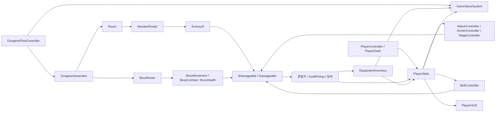

# 2D Dungeon RPG

Unity 6 기반의 2D 픽셀 아트 던전 RPG입니다. 전사, 궁수, 마법사 중 하나를 선택해 절차적으로 연결된 방을 탐험하고, 몬스터와 보스를 처치하며 장비와 골드를 모아 다음 난이도에 도전합니다.

이 문서는 현재 구현된 게임 플레이, 난이도, 상점, 보스, 에셋 적용 범위를 정리합니다.

## 주요 기능

- 전사, 궁수, 마법사 3개 직업과 직업별 일반 공격·고유 스킬
- 전투방, 보물방, 상점방, 보스방으로 구성되는 던전
- 슬라임, 고블린 전사·궁수·마법사, 스켈레톤, 버서커 몬스터
- 모든 몬스터 프리팹의 본체 크기에 맞춘 2D Collider 판정
- 투사체, 상태 이상, 치명타, 방어력, 경험치와 레벨업 시스템
- 무기·방어구 획득, 등급·옵션 부여, 장착과 해제
- Easy부터 Nightmare까지 순차 해금되는 4단계 난이도
- 난이도 진행에 연결된 Easy·Normal·Hard·Nightmare 보스
- 상인 에셋을 적용한 상점 NPC와 난이도별 장비 등급 판매
- 보스 밀림 및 플레이어 맵 이탈을 방지하는 충돌 처리
- Easy Boss 공격 프레임 정리와 한 위치에 정렬된 빠른 사망 애니메이션
- 플레이어 성장, 장비, 골드, 클리어 진행도 자동 저장
- 미니맵, 체력·마나·경험치 HUD, 월드 체력바와 데미지 팝업

## 게임 방법

### 시작과 진행

1. 메인 메뉴에서 새 게임 또는 이어하기를 선택합니다.
2. 새 게임에서는 직업과 캐릭터 외형을 고릅니다.
3. 해금된 난이도를 선택하면 던전이 생성됩니다.
4. 방의 몬스터를 모두 처치해 문을 열고 다음 방으로 이동합니다.
5. 보물과 상점을 이용해 장비를 강화하고 보스방에 도달합니다.
6. 보스를 처치하면 해당 난이도가 클리어되고 다음 난이도가 해금됩니다.

### 조작법

| 입력 | 기능 |
| --- | --- |
| `WASD` / 방향키 | 이동 |
| 마우스 이동 | 공격 방향 조준 |
| 마우스 왼쪽 버튼 | 직업별 일반 공격 |
| `Space` | 대시 |
| `Q` | 직업별 고유 스킬 |
| `1`, `2`, `3` | 전사 무기 변경: 한손검, 대검, 창 |
| `1`, `2` | 궁수 무기 변경: 활, 석궁 |
| `1`, `2` | 마법사 무기 변경: 지팡이, 마법서 |
| `I` | 가방(장비 인벤토리) 열기/닫기 |
| 마우스 휠 / `+`, `-` | 미니맵 확대/축소 |

### 직업별 전투

| 직업 | 일반 공격 | `Q` 스킬 | 특징 |
| --- | --- | --- | --- |
| 전사 | 선택한 근접 무기로 공격 | Whirlwind | 높은 힘을 활용한 근접 범위 공격과 화상 부여 |
| 궁수 | 활 또는 석궁 투사체 발사 | Multishot / Bolt Volley | 조준 방향으로 여러 발을 퍼뜨리는 원거리 공격 |
| 마법사 | 지팡이 또는 마법서 마법탄 발사 | Arcane Nova | 주변 광역 피해와 빙결·감전 상태 이상 부여 |

스킬은 마나와 재사용 대기시간을 사용합니다. 적 처치 시 경험치와 골드를 얻으며, 레벨이 오르면 플레이어 능력치가 성장합니다.

### 상인

상인 근처에서 `F`를 누르면 판매 목록을 열 수 있습니다. 방향키로 상품을 선택하고 다시 `F`를 누르면 구매합니다. 상품은 난이도가 높을수록 더 높은 등급으로 구성됩니다.

| 난이도 | 1번 상품 | 2번 상품 | 3번 상품 |
| --- | --- | --- | --- |
| Easy | Common | Uncommon | Rare |
| Normal | Uncommon | Rare | Epic |
| Hard | Rare | Epic | Legendary |
| Nightmare | Epic | Legendary | Legendary |

상품 가격은 15, 25, 40 Gold이며 한 상점에서 각 상품은 한 번씩 구매할 수 있습니다.

## 난이도

난이도가 높을수록 방과 적의 수가 늘어나고 적의 체력, 공격력, 이동 속도와 보상이 증가합니다.

| 난이도 | 방 수 | 적 체력 배율 | 적 공격력 배율 | 적 수/전투방 | 보상 배율 |
| --- | ---: | ---: | ---: | ---: | ---: |
| Easy | 10~14 | 1.15x | 1.10x | 6~9 | 1.00x |
| Normal | 14~20 | 1.80x | 1.70x | 8~12 | 1.15x |
| Hard | 18~24 | 2.70x | 2.50x | 10~15 | 1.35x |
| Nightmare | 22~30 | 4.20x | 3.80x | 13~18 | 1.80x |

보스 기준 체력은 Easy 5,000, Normal 10,000, Hard 12,500, Nightmare 15,000으로 설정되어 있습니다. Nightmare 보스는 Debug Scene에 직접 배치하지 않고 `Room`과 `BossRoster`를 통해 Nightmare 던전에서 생성됩니다.

## 클래스 구조와 상호작용

아래 그림은 게임 한 판에서 주요 런타임 클래스가 연결되는 방향을 나타냅니다.



### 게임 진행과 던전

| 클래스 | 담당 기능 | 주요 상호작용 |
| --- | --- | --- |
| `DungeonBootstrap` | 게임 실행에 필요한 핵심 오브젝트 초기화 | 던전 진행·생성 시스템을 시작할 수 있는 환경 구성 |
| `DungeonFlowController` | 메뉴, 직업·외형·난이도 선택, 승리·패배, 자동 저장 관리 | `DungeonGenerator`, `PlayerStats`, `EquipmentInventory`, `GameSaveSystem` 연결 |
| `DungeonGenerator` | 연결된 방 배치, 특수방 선정, 방 이동, 카메라와 미니맵 갱신 | `Room`을 만들고 현재 난이도의 `DifficultyModifiers` 전달 |
| `Room` | 입장 감지, 전투 시작, 출입문 잠금·해제, 몬스터 생존 수 관리 | `MonsterRoster`로 적을 생성하고 모든 적 사망 시 `Door` 개방 |
| `Door` | 인접 방으로 이동하는 출입구 | `DungeonGenerator`에 이동 대상 방 전달 |
| `DungeonMinimap` | 방문 여부와 방 종류 표시, 확대·축소 | 생성된 방과 플레이어의 현재 위치를 시각화 |
| `DungeonDifficultyTable` | 방 수, 적 수, 적 능력치와 보상 배율 제공 | `DungeonGenerator`, `MonsterRoster`, `BossRoster`가 같은 난이도 규칙 사용 |

### 플레이어와 전투

| 클래스 | 담당 기능 | 주요 상호작용 |
| --- | --- | --- |
| `PlayerController` | 이동 입력, 방향, 입력 잠금 관리 | 대시·공격 중 이동을 제어하고 시각 방향 갱신 |
| `PlayerDash` | 마나를 사용하는 순간 가속 이동 | `PlayerStats`의 마나와 `PlayerController`의 이동 상태 사용 |
| `PlayerStats` | 직업, HP·마나, 힘·민첩·지능·방어, 레벨·경험치·골드 관리 | 전투 계산, HUD, 장비 효과, 저장 시스템의 중심 데이터 |
| `AttackController` | 전사의 무기 선택, 근접 판정과 공격 연출 | `CombatCalculator`로 피해를 계산하고 대상의 `IDamageable` 호출 |
| `ArcherController` | 활·석궁 선택과 화살 발사 | `ArrowProjectile`을 생성해 원거리 피해 전달 |
| `MageController` | 지팡이·마법서 선택과 마법 공격 | `MagicProjectile`을 생성해 피해와 마법 효과 전달 |
| `SkillController` | 직업별 `Q` 스킬, 마나 비용과 쿨다운 관리 | 플레이어 직업을 읽고 범위 피해 또는 다중 투사체 실행 |
| `CombatCalculator` | 공격력, 방어력, 치명타와 장비 보정 계산 | 플레이어의 능력치와 대상 상태를 최종 피해량으로 변환 |
| `IDamageable` / `Damageable` | 공통 피해 수신, 체력, 사망 이벤트 | 플레이어·몬스터 공격 코드를 구체 타입과 분리 |
| `StatusEffectController` | 화상, 빙결, 감전 등 상태 이상 처리 | 공격·스킬에서 적용되어 지속 피해나 행동 변화를 제공 |
| `PlayerVisualController` | 선택한 외형과 이동·공격 방향의 스프라이트 갱신 | 플레이어 상태를 `PlayerVisualDatabase`의 프레임에 연결 |

### 몬스터와 보스

| 클래스 | 담당 기능 | 주요 상호작용 |
| --- | --- | --- |
| `MonsterRoster` | 몬스터 종류별 기본 능력치·보상 설정과 생성 | 난이도 배율을 적용해 `EnemyAI`와 체력을 구성 |
| `EnemyAI` | 탐지, 추적, 거리 유지, 공격, 피격, 사망과 몬스터별 특성 | 플레이어를 추적하고 근접 공격 또는 `EnemyProjectile` 사용 |
| `EnemyProjectile` | 고블린 궁수·마법사 등의 원거리 공격 전달 | 충돌한 플레이어의 피해 인터페이스 호출 |
| `BossRoster` | 난이도에 맞는 보스 능력치와 구성요소 생성 | `BossMovement`, `BossCombat`, `BossHealth`, `BossAnimator` 설정 및 Nightmare 보스 등록 |
| `BossMovement` | 보스 전용 추적과 위치 제어 | 공격 상태를 존중하고 보스 밀림과 플레이어 맵 이탈을 방지 |
| `BossCombat` | 암흑 충격파, 낙하 공격, 회전 베기, 소환 패턴 | 보스 애니메이션·투사체·소환 생명주기와 연동 |
| `BossHealth` | 보스 체력, 페이즈와 사망 처리 | `BossUI`와 던전 클리어 흐름에 이벤트 전달 |
| `BossAnimator` | 보스 전용 방향·상태 애니메이션 관리 | 일반 몬스터의 시각 처리와 분리되어 보스 상태만 표시 |
| `WorldHealthBar` / `WorldShadow` | 월드 공간 체력바와 발밑 그림자 | 본체 렌더러와 독립적으로 이동·사망 상태 반영 |

몬스터별 동작도 공통 `EnemyAI` 위에 필요한 특성만 추가합니다.

- 슬라임: 사망 시 세대 제한까지 작은 슬라임으로 분열합니다.
- 고블린 전사: 플레이어를 추적해 근접 공격합니다.
- 고블린 궁수·마법사: 일정 거리를 유지하며 전용 투사체를 발사합니다.
- 스켈레톤: 조건을 만족하면 한 번 부활합니다.
- 버서커: 체력이 낮아지면 격노 상태로 강화됩니다.

### 장비, 보상, 저장과 UI

| 클래스 | 담당 기능 | 주요 상호작용 |
| --- | --- | --- |
| `EquipmentData` | 장비 슬롯과 기본 능력치 정의 | 런타임 장비인 `EquipmentItem`의 원본 데이터 |
| `EquipmentItem` / `EquipmentAffix` | 장비 등급, 추가 옵션과 표시 이름 보관 | 장착 시 플레이어 전투 능력치에 반영 |
| `EquipmentInventory` | 장비 보유, 장착·해제, 전리품 획득 관리 | 변경 이벤트로 UI와 자동 저장 갱신 |
| `EquipmentInventoryUI` | `I` 키 장비 목록과 슬롯 UI | `EquipmentInventory`의 장착·해제 기능 호출 |
| `ShopMerchant` | 상인 상호작용, 상품 선택과 장비 구매 | 현재 던전 난이도에 따라 상점 장비 등급 결정 |
| `GoldPickup` / `TreasureChest` | 골드와 장비 보상 제공 | 획득 결과를 `PlayerStats`와 인벤토리에 전달 |
| `GameSaveSystem` | 플레이어 성장, 장비, 난이도 진행도를 JSON으로 저장 | `PlayerPrefs`를 저장소로 사용하며 새 게임·이어하기 지원 |
| `PlayerHUD` | HP, 마나, 경험치, 골드, 스킬 쿨다운 표시 | `PlayerStats`와 `SkillController` 이벤트 구독 |
| `DamagePopup` | 전투 피해량을 화면에 표시 | 피해 발생 위치에서 일시적인 월드 UI 생성 |

## 주요 실행 흐름

### 방 전투

1. 플레이어가 방에 들어가면 `Room`이 전투 시작 여부를 판단합니다.
2. 전투방은 문을 잠그고 `MonsterRoster`를 통해 난이도에 맞는 적을 생성합니다.
3. `EnemyAI`가 플레이어를 탐지해 추적·공격하며, 플레이어 공격은 `IDamageable`을 통해 피해를 전달합니다.
4. 적이 죽으면 경험치, 골드 또는 전리품이 지급됩니다.
5. 방의 모든 적이 사망하면 문이 열리고 다음 방으로 이동할 수 있습니다.

### 저장

- 새 게임 생성, 던전 시작·종료, 레벨업, 장비 변경, 애플리케이션 종료 시점에 저장됩니다.
- 저장 대상에는 직업과 외형, 레벨·경험치, HP·마나, 골드, 장비, 마지막 난이도, 난이도별 클리어 여부가 포함됩니다.
- 새 게임을 확정하면 기존 저장 데이터가 초기화됩니다.

## 프로젝트 구조

```text
Assets/
├─ Scenes/                 게임 씬
├─ Prefabs/                방, 몬스터, 보스, 투사체 등의 프리팹
├─ Sprites/                캐릭터와 오브젝트 스프라이트
│  └─ Enemies/Boss/        보스 본체·공격·사망 애니메이션용 정리 에셋
└─ Scripts/
   ├─ Core/                게임 관리, 저장, 공통 피해 처리
   ├─ Player/              플레이어 이동, 능력치, 시각 처리
   ├─ Combat/              직업별 공격, 스킬, 투사체, 상태 이상
   ├─ Dungeon/             던전 생성, 방, 문, 진행, 미니맵
   ├─ Enemy/               일반 몬스터와 보스 시스템
   ├─ Equipment/           장비 데이터, 인벤토리와 UI
   ├─ UI/                  HUD와 전투 UI
   └─ Editor/              씬·프리팹·스프라이트 자동 설정 도구
```

## 실행 환경과 방법

- Unity Editor: **6000.5.8f1**
- 주요 입력 패키지: Unity Input System
- 기본 대상 플랫폼: Windows Standalone

실행 방법:

1. 저장소를 클론합니다.
2. Unity Hub에서 프로젝트 루트를 엽니다.
3. Unity가 패키지 임포트를 마칠 때까지 기다립니다.
4. `Assets/Scenes`의 게임 씬을 열고 Play 버튼을 누릅니다.

씬이나 에셋 구성이 누락된 개발 환경에서는 Unity 메뉴의 `Tools > 2D Dungeon` 아래 도구를 사용할 수 있습니다. `Build Game Scene`, `Create Room Prefab`, `Setup Equipment System`, 플레이어·몬스터·보스 스프라이트 설정 메뉴가 제공됩니다. 기존 씬과 프리팹을 변경할 수 있으므로 버전 관리 상태를 확인한 뒤 실행하는 것을 권장합니다.

## 개발 시 유의사항

- 일반 몬스터의 행동과 시각 상태는 `EnemyAI`, 보스는 별도의 보스 컴포넌트가 관리합니다.
- 공격 코드와 Animator가 동시에 같은 `SpriteRenderer.sprite`를 제어하지 않도록 렌더링 책임을 한 곳에 유지합니다.
- 새 몬스터는 가능한 한 `MonsterRoster`와 공통 피해 인터페이스를 재사용하고 고유 행동만 확장합니다.
- 난이도 수치는 `DungeonDifficultyTable`에서 한 번에 관리합니다.
- 런타임 생성 오브젝트도 체력바와 그림자를 본체 스프라이트와 별도 계층으로 유지합니다.
